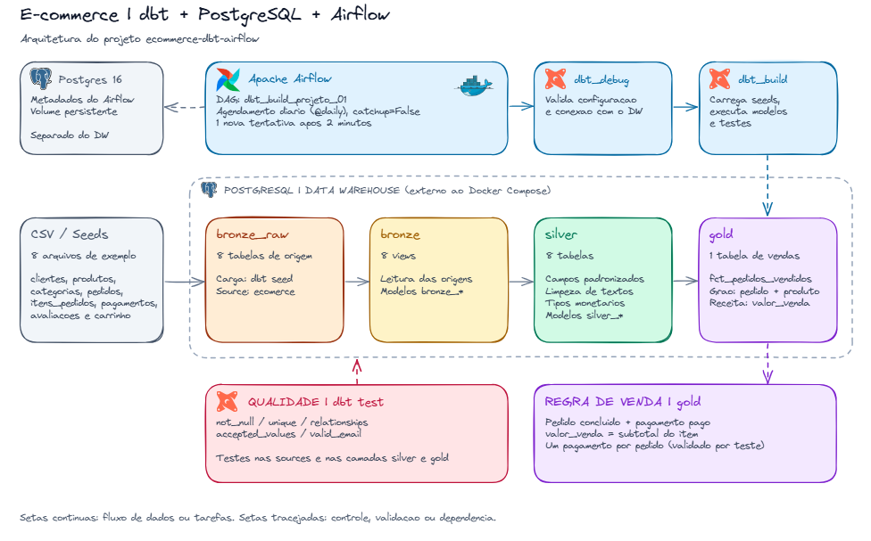

<div align="center">

# 🛒 E-commerce Data Pipeline

**dbt + PostgreSQL + Apache Airflow**

Pipeline de dados de e-commerce com arquitetura medalhão (bronze → silver → gold),<br>
transformações em dbt e orquestração diária pelo Apache Airflow.


</div>

---

## 📑 Sumário

- [🗺️ Arquitetura](#️-arquitetura)
- [🥉🥈🥇 Camadas](#-camadas)
- [💰 Regra de vendas](#-regra-de-vendas)
- [🧰 Tecnologias](#-tecnologias)
- [📁 Estrutura](#-estrutura)
- [⚙️ Configuração](#️-configuração)
- [💻 Executar dbt localmente](#-executar-dbt-localmente)
- [🌀 Executar com Airflow](#-executar-com-airflow)
- [✅ Qualidade dos dados](#-qualidade-dos-dados)
- [📚 Documentação dbt](#-documentação-dbt)

---

## 🗺️ Arquitetura

<div align="center">
  
</div>

> 💡 O diagrama foi feito no [Excalidraw](https://excalidraw.com). Para editá-lo, abra o arquivo [`docs/arquitetura.excalidraw`](docs/arquitetura.excalidraw).

```text
📄 CSV (seeds)
   └─▶ 🟫 bronze_raw   tabelas de origem
        └─▶ 🟨 bronze  views sobre as origens
             └─▶ 🟩 silver   tabelas padronizadas e tipadas
                  └─▶ 🟪 gold     fct_pedidos_vendidos
```

## 🥉🥈🥇 Camadas

| | Camada | Materialização | Conteúdo |
| :---: | --- | --- | --- |
| 📄 | `bronze_raw` | Seeds (tabelas) | Avaliações, carrinho, categorias, clientes, itens de pedidos, pagamentos, pedidos e produtos |
| 🥉 | `bronze` | Views | Oito modelos que consultam a source `ecomerce` |
| 🥈 | `silver` | Tabelas | Oito modelos com renomeação de colunas, limpeza de espaços, normalização de textos e conversão de valores monetários |
| 🥇 | `gold` | Tabela | Fato de itens vendidos, enriquecida com cliente, produto, categoria e pagamento |

> ℹ️ A macro `generate_schema_name` usa os nomes de schema configurados (`silver`, `gold`) diretamente, sem o prefixo do schema do target.

## 💰 Regra de vendas

O modelo `gold.fct_pedidos_vendidos` considera **venda** o pedido com status `concluído` **e** pagamento com status `pago`.

| Item | Definição |
| --- | --- |
| 🔑 **Grão** | Uma linha por pedido + produto, identificada por `item_pedido_id` |
| 💵 **Receita** | `valor_venda` = subtotal do item |
| 💳 **Pagamento** | Um pagamento por pedido, garantido pelo teste de unicidade em `silver_pagamentos.pedido_id` |

> ⚠️ O valor total do pagamento **não** é repetido nos itens, para que a soma de receita não fique inflada.

## 🧰 Tecnologias

| | Ferramenta | Uso |
| :---: | --- | --- |
| 🐍 | **Python 3.12+** e **uv** | Ambiente local |
| 🔶 | **dbt-core 1.12.5** + **dbt-postgres 1.11.0** | Transformações e testes |
| 🌀 | **Apache Airflow 3.3.0** (`LocalExecutor`) | Orquestração |
| 🐳 | **Docker Compose** | Sobe o Airflow, com o dbt num ambiente Python separado dentro da imagem |
| 🐘 | **PostgreSQL** | Data warehouse e banco de metadados do Airflow (PostgreSQL 16) |

## 📁 Estrutura

```text
.
├── 📄 README.md
├── 🔐 .env.example                 # Modelo de configuração
├── 🐍 pyproject.toml               # Dependências Python
├── 🔒 uv.lock
├── 🐳 docker-compose.yml           # Serviços Airflow e banco de metadados
├── 🖼️ docs/
│   ├── fluxo.png                   # Diagrama da arquitetura
│   └── arquitetura.excalidraw      # Fonte editável do diagrama
├── 🌀 airflow/
│   ├── Dockerfile                  # Airflow com ambiente dbt separado
│   ├── dags/dbt_build_projeto_01.py
│   └── dbt_profiles/profiles.yml
└── 🔶 projeto_01/
    ├── dbt_project.yml
    ├── models/
    │   ├── bronze/
    │   ├── silver/
    │   └── gold/
    ├── seeds/                      # Oito arquivos CSV
    ├── macros/generate_schema_name.sql
    └── tests/generic/valid_email.sql
```

## ⚙️ Configuração

### 📋 Pré-requisitos

- 🐳 Docker com Compose, para executar o Airflow
- 🐘 Um PostgreSQL acessível para o data warehouse
- 🐍 Python e `uv`, para executar o dbt pelo terminal

### 🔐 Variáveis de ambiente

Na raiz do repositório, crie o arquivo de configuração:

```bash
cp -n .env.example .env
```

Edite o `.env` com os valores do seu ambiente:

| Variável | Uso |
| --- | --- |
| `AIRFLOW_UID` | UID do usuário usado pelos containers (consulte com `id -u`) |
| `AIRFLOW_DB_USER` | Usuário do banco de metadados do Airflow |
| `AIRFLOW_DB_PASSWORD` | Senha do banco de metadados do Airflow |
| `AIRFLOW_JWT_SECRET` | Chave compartilhada pelos serviços do Airflow |
| `DBT_HOST` | Host do PostgreSQL do data warehouse |
| `DBT_PORT` | Porta do PostgreSQL, normalmente `5432` |
| `DBT_USER` | Usuário do data warehouse |
| `DBT_PASSWORD` | Senha do usuário |
| `DBT_DBNAME` | Banco do data warehouse |

Gere uma chave para `AIRFLOW_JWT_SECRET`:

```bash
python3 -c "import secrets; print(secrets.token_urlsafe(64))"
```

> [!IMPORTANT]
> O banco indicado em `DBT_DBNAME` precisa existir, e o usuário precisa de permissão para criar schemas, tabelas e views. O serviço `postgres` do Compose guarda **apenas** os metadados do Airflow; ele não cria o data warehouse.

> [!TIP]
> **Data warehouse no WSL com Docker Desktop:** configure `DBT_HOST` com o IP do WSL (`hostname -I`). No Docker Desktop, `host.docker.internal` aponta para o Windows, não para o WSL. O IP do WSL pode mudar quando ele reinicia.

> [!CAUTION]
> O `.env` está no `.gitignore`. Nunca publique credenciais no repositório.

## 💻 Executar dbt localmente

Os comandos abaixo rodam na raiz do repositório e usam o profile versionado em `airflow/dbt_profiles`:

```bash
uv sync --locked

set -a
source .env
set +a

uv run dbt debug --project-dir projeto_01 --profiles-dir airflow/dbt_profiles
uv run dbt build --project-dir projeto_01 --profiles-dir airflow/dbt_profiles
```

- 🩺 `dbt debug` verifica a configuração e a conexão.
- 🏗️ `dbt build` carrega os seeds, cria os modelos e executa os testes, respeitando as dependências.

<details>
<summary>▶️ <b>Executar as etapas separadamente</b></summary>

```bash
uv run dbt seed --project-dir projeto_01 --profiles-dir airflow/dbt_profiles
uv run dbt run  --project-dir projeto_01 --profiles-dir airflow/dbt_profiles
uv run dbt test --project-dir projeto_01 --profiles-dir airflow/dbt_profiles
```

Depois da carga inicial, dá para reconstruir só a camada gold:

```bash
uv run dbt build --select tag:gold --project-dir projeto_01 --profiles-dir airflow/dbt_profiles
```

</details>

## 🌀 Executar com Airflow

Com o `.env` configurado, execute na raiz:

```bash
docker compose up airflow-init --build
docker compose up -d airflow-apiserver airflow-scheduler airflow-dag-processor
docker compose ps
```

🌐 Acesse **[http://localhost:8091](http://localhost:8091)**. Na configuração local, você entra direto como administrador, sem tela de login.

### 🔁 DAG `dbt_build_projeto_01`

```text
🩺 dbt_debug  ──▶  🏗️ dbt_build
```

| Configuração | Valor |
| --- | --- |
| ⏰ Agendamento | `@daily`, a partir de 1º de outubro de 2026 |
| ⏸️ Estado inicial | Criada pausada: ative-a ou dispare uma execução manual pela interface |
| ⏭️ `catchup` | `False`: não executa os intervalos passados |
| 🔄 Retentativas | 1 nova tentativa após 2 minutos |
| 📂 Projeto dbt | Montado em `/opt/airflow/dbt/projeto_01` |
| 🗃️ Artefatos | `/tmp/dbt_target` e `/tmp/dbt_logs` dentro do container, separados dos locais |

Para acompanhar os serviços ou desligá-los:

```bash
docker compose logs -f airflow-scheduler airflow-dag-processor airflow-apiserver
docker compose down
```

> ℹ️ `docker compose down` preserva o volume do banco de metadados.

## ✅ Qualidade dos dados

Os testes estão definidos nas sources e nos modelos silver e gold:

| Teste | O que garante |
| --- | --- |
| 🔑 `not_null` / `unique` | Campos obrigatórios e chaves sem nulos nem duplicatas |
| 🔗 `relationships` | Referências válidas entre clientes, pedidos, produtos e categorias |
| 📋 `accepted_values` | Status de pedidos, status de pagamentos e notas de avaliações dentro dos valores esperados |
| 📧 `valid_email` | Formato de e-mail válido (teste genérico com regex do PostgreSQL; ignora nulos) |

> ℹ️ A silver padroniza os dados. Os testes de unicidade **apontam** duplicatas, mas não as removem.

## 📚 Documentação dbt

Com as variáveis do `.env` carregadas no terminal:

```bash
uv run dbt docs generate --project-dir projeto_01 --profiles-dir airflow/dbt_profiles
uv run dbt docs serve    --project-dir projeto_01 --profiles-dir airflow/dbt_profiles --port 8082
```

📖 A documentação fica em **[http://localhost:8082](http://localhost:8082)**, com descrições, colunas, testes e o grafo de dependências (lineage) dos modelos.

---

<div align="center">

Feito por **[Levi de Castro](https://github.com/Levi7Castro)**

</div>
